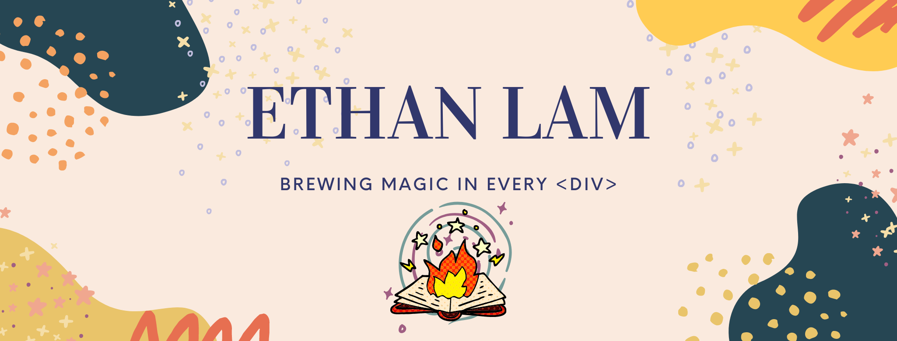

Coming to you from tropical Vietnam :vietnam:  
Currently lived in Atlanta, Georgia for more than 10 years  
New York is always in my heart :statue_of_liberty:  
I have a never ending love for beautiful graphics and minimalism 

 Proud to be world-class flight attendant for Delta Air Lines for almost 4 yeats. I love travelling but I always feel like I want to learn more. So I chose to attend Georgia Tech Full Stack Flex Coding Bootcamp with a bunch of a talented growing developer :woman_technologist: :man_technologist: :woman_scientist: :woman_artist: :man_astronaut:. 

var skills = \[html, css, javascript, node.js, API, ES6, Bootstrap, Jquery, Bulma, Git, Adobe XD, Photoshop, Illustrator, terminal\]  
while ( true ) {  
return  <strong>"I love coding !!!"</strong>
}

